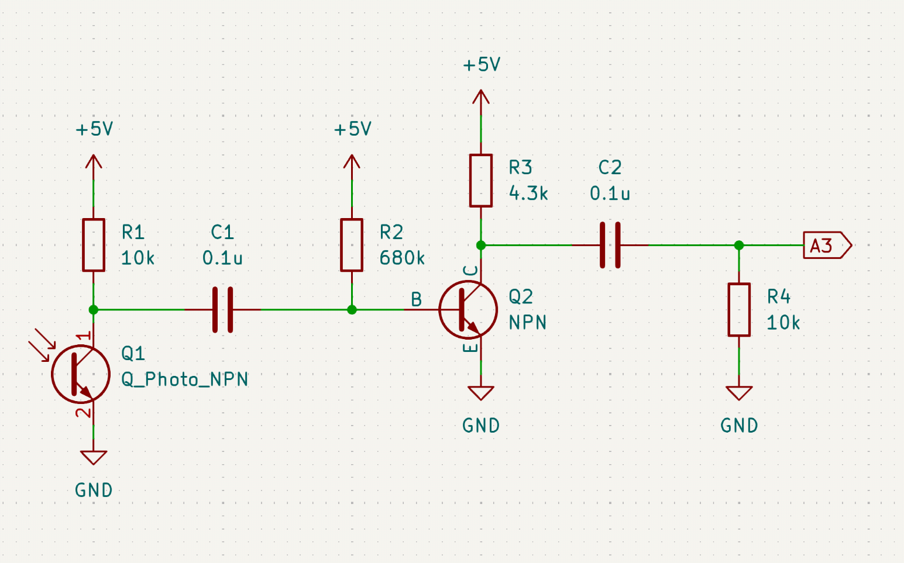

# IR sensor for First Year Project



Circuit output goes to PA04 - A3.
Code is in /src/ - use AC_INT_ONLY for now

The code enables the built in analog comparator and routes PA04 to one of its input, and the internal 1.1V bandap reference to the other. It generates an interrupt on every rising edge of the IR sensor. The frequency is measured in the ISR by using the micros() function.

The other script routes the comparator output to a timer to measure the period without using interrupts but is less accurate for some reason.

## ToE

The IR signal is a PWM signal with ~20µs pulse width and a variable frequency, depending on the species of the lizard.

This light signal is detected by the basic phototransistor supplied with the lab rover kit in a common emitter configuration, which inverts the positive pulses to negative pulses. This is then amplified by ~x5 with a common emitter amplifier after being AC coupled. The output is then a series of amplified positive pulses that are ground referenced and fed into the A3 (PA04) input on the SAMD21 µC.

The amplifier base is biased so that the collector operating point is just above 0V, since the output of interest only swings positive. The gain and tehrefore the sensitivity could be increased by adding an acitve load, and it could be stabilised by adding an emitter resistor. However, these are not important in this design.


```↑ Blue: Collector of the phototransistor, Yellow: Output of the amplfier and input to the µC```

Inside the µC, the AC pin MUX is connected to the AIN0 input of the two integrated analog comparators (AC0), and connected to the positive input of the comparator. The negative input is connected to the internal 1.1V reference. The comparator interrupts are configured to produce a CPU interrupt on every rising edge, where the code measures the time elapsed between pulses and then the frequency.

In one of the designs for the magnetic sensor, a 0.5V reference voltage is reqired to be read by the ADC on startup. Since it is already connected to an analog input, it can be used as the negative input to the AC after it is read by the ADC to improve range.

The range is betweeen varied between 25-30cm depending on external conditions, and is more than enough considering other sensors have a range of < 15 cm.